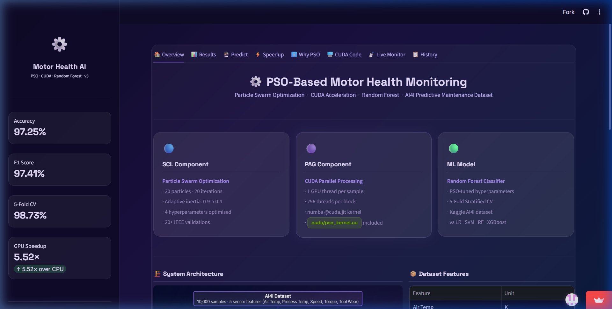
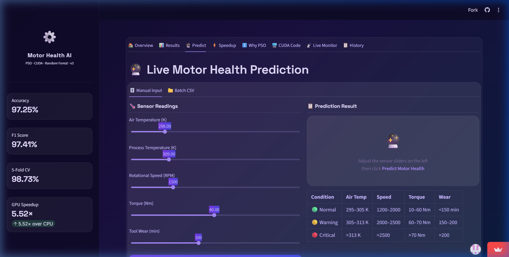
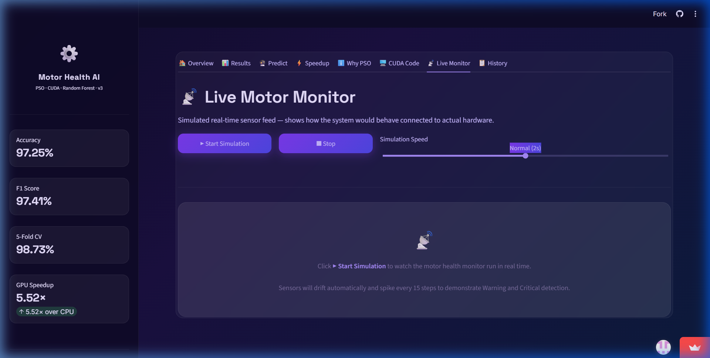
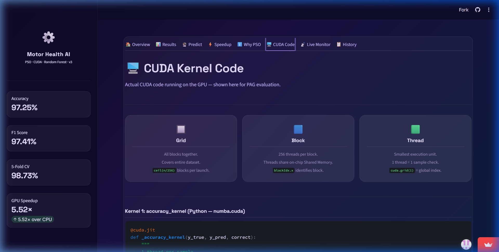

# AeroForge: Autonomous Predictive Edge AI

[](https://www.python.org/downloads/release/python-3100/)
[](https://developer.nvidia.com/cuda-toolkit)
[](https://opensource.org/licenses/MIT)
[](https://motor-health-pso-cuda.streamlit.app/)

AeroForge is an autonomous, self-healing, edge-native predictive maintenance platform engineered to monitor industrial motors. It ingests high-frequency telemetry, performs ultra-low-latency inference, generates cryptographically sound explanations for its predictions, and autonomously retrains its models using GPU-accelerated heuristic swarm optimization when hardware degradation (concept drift) is detected.

---

## 🖥️ Live Deployment

Experience the inference dashboard live:  
👉 **[motor-health-pso-cuda.streamlit.app](https://motor-health-pso-cuda.streamlit.app/)**



---

## 🧠 Core Innovations

1. **Real-Time Telemetry Ingestion:** Subscribes to endless IoT sensory data from factory environments.
2. **Asynchronous HPC Pipelines (CUDA PSO):** Accelerates Particle Swarm Optimization by offloading heavy heuristic vector mathematics to Nvidia GPUs using `numba`.
3. **Explainable AI (TreeSHAP):** Provides cryptographically sound feature-attribution logic for trust in mission-critical alerts.
4. **Adaptive Self-Healing Engine (MLOps):** Continuously monitors live data for concept drift and autonomously triggers optimization retraining to prevent model degradation.
5. **Edge AI Focus:** Designed to run with extreme low latency on resource-constrained Edge devices (e.g., Nvidia Jetson).

---

## 🛠️ Enterprise Architecture Blueprints

AeroForge was engineered using rigorous enterprise design methodologies. The complete engineering roadmap, PRD, TRD, SAD, and Architecture Review Board sign-offs are fully documented in version control.

📚 **[View the Complete Engineering Handbook](docs/architecture/AEROFORGE_ENGINEERING_HANDBOOK.md)**

* [Vision Freeze & Identity](docs/architecture/VISION_FREEZE.md)
* [Product Requirements Document (PRD)](docs/architecture/AEROFORGE_PRD.md)
* [Technical Requirements Document (TRD)](docs/architecture/AEROFORGE_TRD.md)
* [Software Architecture Design (SAD)](docs/architecture/AEROFORGE_SAD.md)
* [Detailed Engineering Design (DED)](docs/architecture/AEROFORGE_DED.md)

---

## 📸 Interface Showcase

### Manual Prediction & What-If Analysis


### Live Telemetry Simulation


### Transparent GPU Code & Bottleneck Analysis


---

## 🚀 Quick Start (Local Development)

### 1. Requirements
* Python 3.10+
* Nvidia GPU with CUDA Toolkit 12.x installed
* Poetry for dependency management

### 2. Installation
```bash
git clone https://github.com/Ravva-78/motor-health-pso-cuda.git
cd motor-health-pso-cuda
poetry install
```

### 3. Run the Dashboard
```bash
poetry run streamlit run app.py
```

---

## 📄 License
This project is licensed under the MIT License - see the [LICENSE](LICENSE) file for details.
