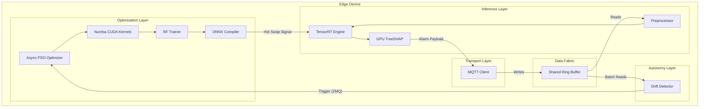
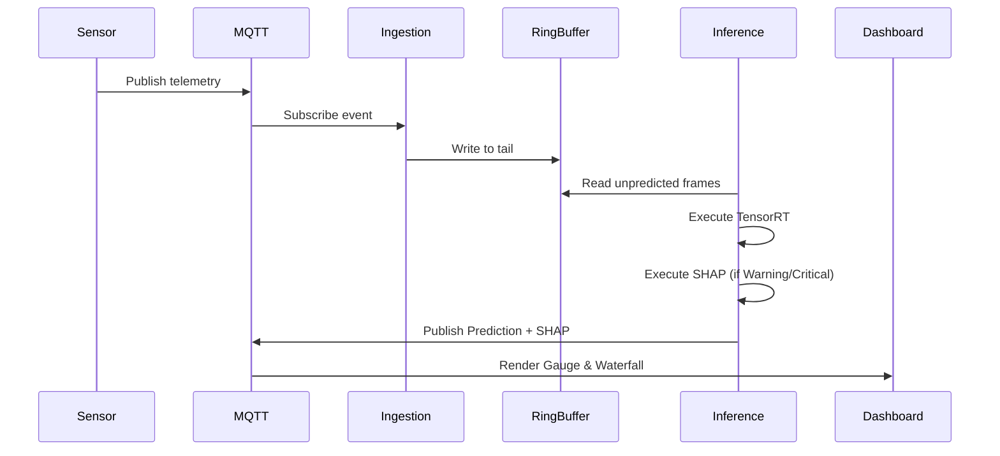
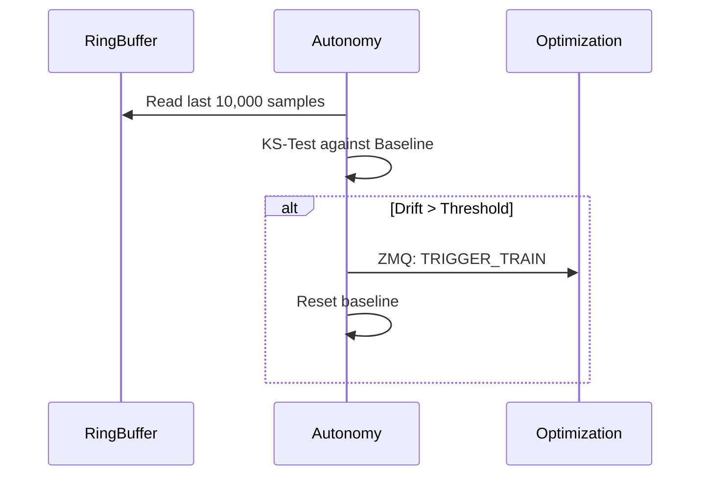
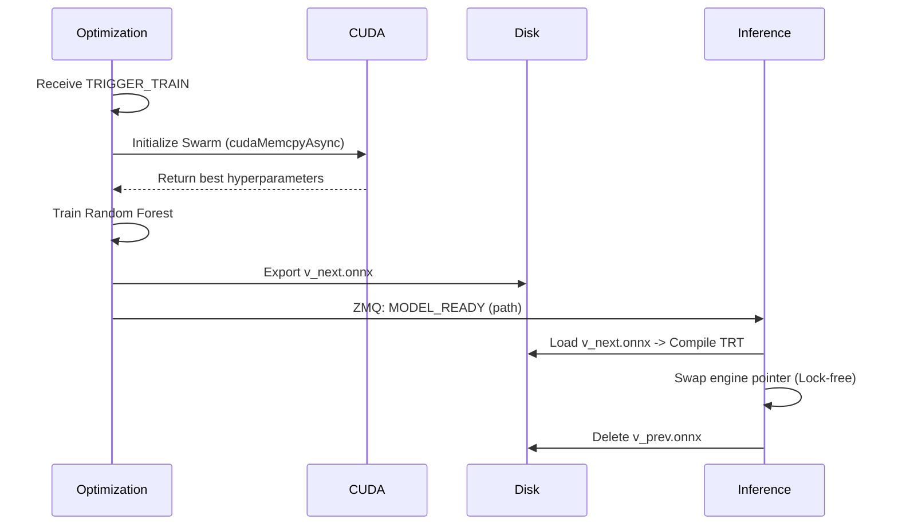

# Software Architecture Design (SAD)
**Project Name:** AeroForge – Autonomous Predictive Edge AI Platform
**Document Owner:** Chief Software Architect & Enterprise Solution Architect
**Review Board:** Principal Architects (Siemens, Bosch, Tesla, Microsoft, ABB)
**Status:** APPROVED FOR ENGINEERING

---

## PART 1: Enterprise Architecture Overview

AeroForge operates on an event-driven, decoupled micro-monolith architecture designed specifically for resource-constrained Edge devices (e.g., Nvidia Jetson). The primary architectural mandate is strict isolation between the **Fast Path** (Telemetry Ingestion & Inference) and the **Slow Path** (Drift Detection & Heuristic Optimization). The architecture guarantees that compute-intensive model retraining will never interrupt or delay real-time health predictions.

---

## PART 2: Layered Architecture

The software is structured into five distinct vertical layers:

1.  **Transport Layer:** Responsible for external I/O. Handles MQTT protocol connections, payload serialization (JSON/ProtoBuf), and socket lifecycle management.
2.  **Data Fabric Layer:** The internal central nervous system. A shared-memory Circular Ring Buffer that acts as the single source of truth for both inference and training, eliminating memory duplication.
3.  **Inference Layer (Fast Path):** Executes pre-compiled TensorRT engines for health classification and TreeSHAP calculations. Bound by strict sub-100ms latency constraints.
4.  **Autonomy Layer (Slow Path):** Executes continuous background statistical tests for concept drift (Kolmogorov-Smirnov). Triggers the optimization layer when thresholds are breached.
5.  **Optimization Layer:** Orchestrates the Numba CUDA Particle Swarm Optimization (PSO) to retrain Random Forest models. Compiles the result to ONNX.

---

## PART 3: Component Diagram

---

## PART 4: Module Interaction Diagram

The system uses Inter-Process Communication (IPC) via ZeroMQ (ZMQ) for control signals, ensuring the GIL (Global Interpreter Lock) in one process does not block another.

*   **Ingestion Process:** Pushes data to Shared Memory.
*   **Inference Process:** Polls Shared Memory at 10Hz. Publishes to MQTT.
*   **Autonomy Process:** Polls Shared Memory at 0.1Hz. Sends ZMQ `TRIGGER_TRAIN` to Optimization.
*   **Optimization Process:** Awaits ZMQ signal. Writes `.onnx` to disk. Sends ZMQ `MODEL_READY` to Inference.

---

## PART 5: Sequence Diagrams

### 5.1 Normal Prediction Flow

### 5.2 Drift Detection Flow

### 5.3 Self-Healing Flow

---

## PART 6: State Machines

### 6.1 Motor Lifecycle (Hardware State)
*   **INIT:** Baseline calibration phase.
*   **NORMAL:** Telemetry within historical bounds.
*   **WARNING:** Sub-critical anomaly detected (e.g., slight temperature rise). Maintenance recommended.
*   **CRITICAL:** Imminent failure threshold breached. Immediate shutdown recommended.
*   **MAINTENANCE:** Operator overrides alarms during physical repairs.

### 6.2 Inference Lifecycle (Software State)
*   **BOOT:** Loading ONNX, compiling TensorRT engine.
*   **LISTENING:** Polling ring buffer for new data.
*   **INFERRING:** Executing GPU forward pass.
*   **HOT_SWAPPING:** Momentarily buffering inputs while the TRT engine pointer is updated with a new model.

---

## PART 7: Deployment Architecture

The system utilizes a containerized micro-deployment strategy orchestrated by `k3s`.

*   **ESP32 (Microcontroller):** Hardwired to physical sensors. Publishes raw JSON to MQTT over WiFi/Ethernet.
*   **MQTT Broker (Mosquitto):** Runs as a lightweight Docker container on the Edge device.
*   **Jetson Edge Node (Hardware):** Hosts the `k3s` cluster. Requires Nvidia Container Toolkit for GPU passthrough.
*   **AeroForge Pod:** Contains three containers sharing IPC namespaces:
    1.  `aeroforge-inference` (Fast Path)
    2.  `aeroforge-optimization` (Slow Path)
    3.  `aeroforge-ingestion`
*   **Dashboard / Laptop:** A separate machine on the local network subscribing to the MQTT broker to render the Streamlit UI.

---

## PART 8: Failure Architecture

*   **Network Failure (WiFi Drop):** Ingestion module buffers locally to disk (SQLite) until connection to MQTT is restored. Inference continues on buffered data.
*   **GPU Failure (OOM / Timeout):** If TensorRT crashes due to VRAM fragmentation, the `k3s` supervisor immediately restarts the `aeroforge-inference` pod. Recovery time: <3 seconds.
*   **MQTT Broker Failure:** Both ESP32 and Ingestion modules enter an exponential backoff retry loop.
*   **Optimization Failure:** If the PSO CUDA kernel illegal accesses memory, the `aeroforge-optimization` process dies. Inference is entirely unaffected. The supervisor restarts optimization from the last epoch checkpoint.

---

## PART 9: Security Architecture

*   **Authentication:** MQTT broker requires TLS 1.2 certificates and x509 mutual authentication for all edge devices (ESP32) and dashboards.
*   **Encryption:** Data at rest (saved models, checkpoints) is encrypted using AES-256.
*   **Secrets:** Managed via Kubernetes Secrets mounted as read-only volumes. `.env` files are strictly prohibited.
*   **Model Security:** ONNX files are cryptographically signed during the Optimization phase. The Inference module verifies the signature before loading to prevent adversarial model injection.

---

## PART 10: Performance Architecture

*   **Latency Budget:**
    *   MQTT Ingestion: 5ms
    *   Buffer Read: 1ms
    *   TensorRT Inference: 15ms
    *   TreeSHAP Execution: 40ms
    *   MQTT Egress: 5ms
    *   **Total Expected Latency:** ~66ms (Well under the 100ms constraint).
*   **GPU Memory:** Pre-allocated. Inference is capped at 2GB VRAM. Optimization is capped at 4GB VRAM. 2GB reserved for OS/GUI.
*   **CPU Usage:** Pinned threads via `taskset` to prevent context switching overhead.

---

## PART 11: Data Lifecycle

1.  **Raw Telemetry:** Volatile. Lives in the Ring Buffer for exactly 10,000 frames. Automatically overwritten.
2.  **Processing:** Normalized via MinMaxScaler.
3.  **Prediction:** Health status and SHAP values are published to MQTT.
4.  **Archival:** Aggregated hourly summaries (Mean Temp, Max Torque) are saved to local SQLite for historical drift baselining. Raw data is NEVER archived to save storage.
5.  **Deletion:** SQLite historical database implements a rolling 30-day deletion policy.

---

## PART 12: Engineering Quality Gates

*   **Verification Gates (PR Review):** Every Pull Request requires passing linters (`flake8`, `black`) and static type checks (`mypy`).
*   **Testing Gates (CI):** GitHub Actions will execute PyTest suites. Must achieve >80% coverage. CUDA kernels are mocked on CI unless self-hosted GPU runners are available.
*   **Deployment Gates (CD):** Before a container is pushed to the production registry, it must pass a vulnerability scan (`trivy`) and a dry-run inference test confirming sub-100ms latency.

---

## PART 13: Future Evolution (V2 / V3)

*   **Version 2 (Multi-Motor & Fleet Management):** The architecture will evolve to support dynamic TensorRT batching. The Ring Buffer will be partitioned by `motor_id`, allowing a single Jetson to monitor 50+ motors simultaneously.
*   **Version 3 (Federated Learning):** The Optimization layer will push its locally calculated `gBest` particles to a centralized cloud parameter server, allowing Edge Node A to learn from the failure patterns of Edge Node B without transmitting raw, proprietary telemetry.

---
**END OF DOCUMENT.**
*(Approved by Chief Software Architect)*
