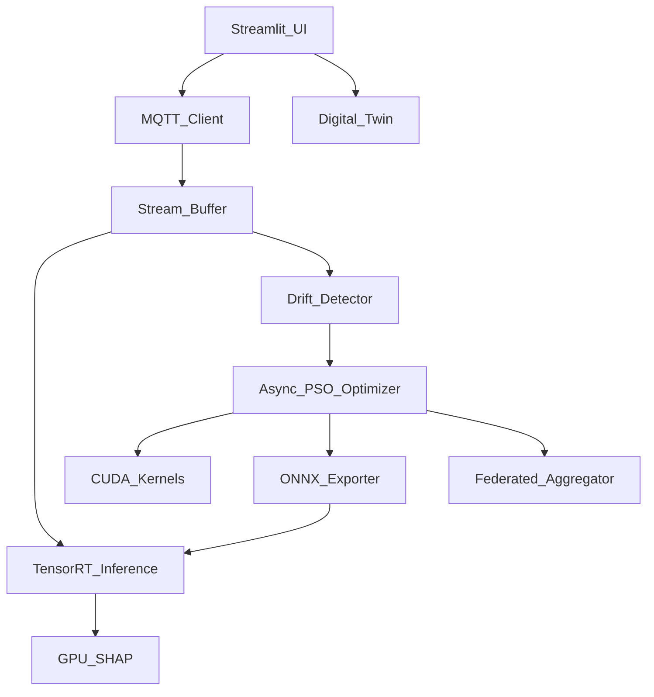

# Industry 4.0 Transformation Roadmap
**Project:** PSO Motor Health Monitoring System v4.0 (Enterprise Edition)
**Authors:** Ravva Nagarjun
**Timeline:** 6-12 Months
**Objective:** Transform a standalone academic ML/CUDA project into a distributed, edge-native, real-time industrial predictive maintenance platform.

---

## Part I: Phased Development Roadmap

### Phase 1: Real-Time Telemetry & Data Streaming (Months 1-2)
**Objective:** Shift from static CSV ingestion to continuous, real-time IoT data streams simulating a live factory floor.
**Features to implement:** 
- MQTT Broker integration for high-frequency sensor data ingestion.
- Sliding-window data buffers in Python.
- Live updating Streamlit dashboard (replacing manual sliders).
**Architecture diagram:** 
`Sensors -> MQTT Publisher -> MQTT Broker (Mosquitto) -> Python Subscriber -> Sliding Buffer -> RF Inference -> Streamlit`
**New modules required:** `mqtt_client.py`, `stream_buffer.py`
**Folder structure changes:** Add `/iot_core/` and `/streaming/` directories.
**Technologies required:** Paho-MQTT, Mosquitto, asyncio.
**External libraries:** `paho-mqtt`, `collections.deque`.
**Risks:** High frequency data might choke the Streamlit rendering loop.
**Dependencies:** None.
**Estimated implementation time:** 4-6 weeks.
**Expected learning outcomes:** IoT protocols, asynchronous programming, real-time UI rendering.
**Resume value:** 8/10 (Proves you understand real-world data pipelines).
**Research value:** 3/10
**Future scalability:** Extremely high; standardizes data entry for all future phases.

### Phase 2: Asynchronous HPC & CUDA Streams (Months 3-4)
**Objective:** Maximize GPU utilization by decoupling the fitness evaluation from the PSO velocity updates.
**Features to implement:** 
- CUDA streams for asynchronous memory transfers (`cudaMemcpyAsync`).
- Overlapped CPU/GPU execution during the PSO loop.
- Multi-threaded particle evaluation.
**Architecture diagram:** 
`PSO Loop -> Dispatch Particle to Thread -> cudaMemcpyAsync -> Numba Kernel Execute -> cudaMemcpyAsync -> CPU Velocity Update`
**New modules required:** `async_pso_optimizer.py`, `cuda_streams.py`
**Folder structure changes:** Expand `/cuda/` to include `/cuda/async_kernels/`.
**Technologies required:** CUDA Streams, Python `concurrent.futures`.
**External libraries:** `numba.cuda.stream`.
**Risks:** Race conditions in memory access; difficult to debug CUDA illegal memory accesses.
**Dependencies:** Phase 1 (for testing throughput).
**Estimated implementation time:** 6-8 weeks.
**Expected learning outcomes:** Advanced GPU memory management, concurrency, thread-safety.
**Resume value:** 10/10 (NVIDIA / AMD recruiter magnet).
**Research value:** 6/10
**Future scalability:** Allows scaling swarm size from 20 to 10,000+ particles without CPU bottlenecks.

### Phase 3: Drift Detection & Self-Healing AI (Months 5-6)
**Objective:** Ensure long-term reliability by detecting motor aging and automatically triggering the PSO retraining pipeline.
**Features to implement:** 
- Statistical drift detection (e.g., Kolmogorov-Smirnov test) on the sliding window buffer.
- Automated background PSO re-triggering.
- Model registry to hot-swap updated RF models without downtime.
**Architecture diagram:** 
`Stream Buffer -> Drift Detector (Evidently) -> If Drift > Threshold -> Trigger async_pso_optimizer -> Save new_model.pkl -> Hot Reload in Inference Engine`
**New modules required:** `drift_monitor.py`, `model_registry.py`
**Folder structure changes:** Add `/mlops/` directory.
**Technologies required:** Statistical testing, background task queues.
**External libraries:** `scipy.stats`, `evidently`, `celery` (optional).
**Risks:** False positives in drift detection leading to infinite retraining loops.
**Dependencies:** Phase 1 and 2.
**Estimated implementation time:** 6 weeks.
**Expected learning outcomes:** MLOps, concept drift, automated retraining pipelines.
**Resume value:** 9/10 (Crucial for applied ML roles).
**Research value:** 8/10
**Future scalability:** Prevents model decay over years of operation.

### Phase 4: Edge-Native Inference & Explainable AI (Months 7-8)
**Objective:** Push inference to the Edge (e.g., Nvidia Jetson) and provide real-time cryptographic explanations for critical alarms.
**Features to implement:** 
- Export RF to ONNX format.
- TensorRT engine compilation.
- GPU-accelerated TreeSHAP for feature importance on every inference.
**Architecture diagram:** 
`Trained RF -> ONNX Converter -> TensorRT Engine -> Jetson Nano -> Inference + TreeSHAP -> MQTT Publish Alarm + SHAP Values`
**New modules required:** `onnx_exporter.py`, `tensorrt_infer.py`, `gpu_shap.py`
**Folder structure changes:** Add `/edge/` and `/xai/` directories.
**Technologies required:** ONNX, TensorRT, RAPIDS cuML (for GPU SHAP).
**External libraries:** `onnxruntime`, `tensorrt`, `shap`.
**Risks:** ONNX/TensorRT compatibility with certain RF scikit-learn operators.
**Dependencies:** Phase 2 and 3.
**Estimated implementation time:** 8 weeks.
**Expected learning outcomes:** Edge AI compilation, XAI, C++/Python bindings.
**Resume value:** 10/10 (Edge AI is highly sought after).
**Research value:** 7/10
**Future scalability:** Allows deployment to disconnected factory floors.

### Phase 5: Digital Twin & Multi-Agent Swarm (Months 9-12)
**Objective:** Scale from monitoring one motor to a decentralized fleet of motors sharing intelligence.
**Features to implement:** 
- Federated learning topology (particles represent local motor gradients).
- 3D Digital Twin visualization in the Streamlit dashboard mapping live data to physical components.
**Architecture diagram:** 
`Edge Node 1..N -> Extract Local gBest -> MQTT Broker -> Global Aggregator -> Broadcast Global gBest -> Update Edge Nodes`
**New modules required:** `federated_aggregator.py`, `twin_visualizer.py`
**Folder structure changes:** Add `/federated/` and `/digital_twin/` directories.
**Technologies required:** Distributed Systems, WebGL/Three.js (via Streamlit components).
**External libraries:** `streamlit-threejs` or `pydeck`.
**Risks:** High architectural complexity; network partitions causing split-brain optimization.
**Dependencies:** Phases 1-4.
**Estimated implementation time:** 12 weeks.
**Expected learning outcomes:** Distributed AI, Digital Twins, Fleet Management.
**Resume value:** 10/10 (Siemens, Tesla, Bosch).
**Research value:** 10/10
**Future scalability:** True Industry 4.0 architecture; infinite horizontal scaling.

---

## Part II: Complete Architecture Designs

### 1. Software Architecture (Modular Monolith transitioning to Microservices)
The project will remain a monorepo but logically separated by domain:
- **Presentation Layer:** Streamlit (UI, Digital Twin, SHAP charts)
- **Application Layer:** Inference Engine (ONNX/TensorRT), Drift Monitor.
- **Optimization Layer:** Asynchronous PSO, CUDA kernels.
- **Data Layer:** MQTT Client, Sliding Buffers, Local Checkpoints.

### 2. Data Flow Architecture
`Physical Motor Sensors (Simulated) -> JSON Payload -> MQTT Broker (Topic: factory/motor/telemetry) -> Python MQTT Client -> Deque Buffer (Window Size=50) -> [Split]`
- `[Split A] -> Drift Detector -> (If Drift) -> Retrain Queue`
- `[Split B] -> TensorRT Inference Engine -> Health Prediction -> SHAP Explainer -> MQTT Broker (Topic: factory/motor/alarms) -> Dashboard`

### 3. GPU Architecture
**Training (PSO):** 
- Host allocates pinned memory for particle positions.
- `cudaMemcpyAsync` streams data to Device.
- Numba kernel computes RF fitness across $N$ threads using Grid-Stride loops.
- `cudaMemcpyAsync` streams fitness back to Host. CPU updates velocities.
**Inference (Edge):**
- TensorRT engine loaded into GPU VRAM.
- Inference occurs entirely on Device, bypassing CPU bottlenecks.

### 4. IoT & Edge AI Architecture
- **Edge Device:** Nvidia Jetson Orin Nano sitting physically near the motor.
- **Compute:** Runs the TensorRT Engine and the MQTT Client.
- **Protocol:** OPC-UA or MQTT for intra-factory communication.
- **Cloud/Server:** Central server hosts the Streamlit Dashboard and the Federated Aggregator.

### 5. Module Dependency Graph

---

## Part III: Engineering Strategy

### Git Branch Strategy (GitFlow Modified)
- `main`: Production-ready, deployable codebase. Highly protected.
- `develop`: Integration branch. All features merge here first.
- `feature/iot-mqtt`: e.g., Phase 1 features.
- `feature/cuda-streams`: e.g., Phase 2 features.
- `release/v4.x`: Cut from develop when a phase is complete for QA before merging to `main`.

### Testing Strategy
- **Unit Tests (`pytest`):** Mock MQTT brokers to test the streaming buffer logic. Test PSO math limits.
- **Integration Tests:** Ensure `Async_PSO_Optimizer` successfully exports an ONNX model that `TensorRT_Inference` can read.
- **Hardware-in-the-Loop (HIL) Tests:** Run the CUDA tests specifically on a GPU runner (e.g., GitHub Actions with self-hosted Nvidia runners) to ensure memory safety.

### Deployment Strategy
- **Containerization:** The entire backend (MQTT, Inference, PSO) packaged into `docker-compose.yml`.
- **Edge Deployment:** `k3s` (lightweight Kubernetes) deployed to Jetson Edge nodes, pulling images from a container registry.
- **Dashboard:** Deployed to a centralized internal server or AWS/GCP for plant managers.

### Documentation Strategy
- **Architecture Decision Records (ADRs):** Every major library choice (e.g., Numba vs CuPy, Mosquitto vs Kafka) documented in an `/docs/adr/` folder.
- **Sphinx/MkDocs:** Auto-generated API documentation for the Python classes.
- **Runbooks:** Clear instructions on how to start the MQTT broker, simulate data, and trigger a model drift manually.

---

## Conclusion: The 12-Month Vision
By month 12, this project will no longer be a script that runs on a laptop. It will be a **Distributed, Edge-Native, GPU-Accelerated Predictive Maintenance Fleet**. 

When you sit in an interview at NVIDIA or Bosch, you will not be talking about "accuracy percentages." You will be talking about *memory bandwidth optimization, asynchronous CUDA streams, MQTT telemetry backpressure, and handling concept drift on Edge devices*. That is how you secure a Principal or Senior Engineer role out of a university project.
